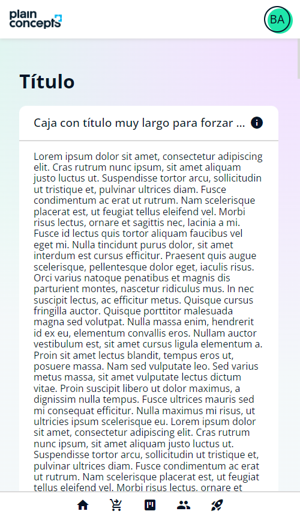
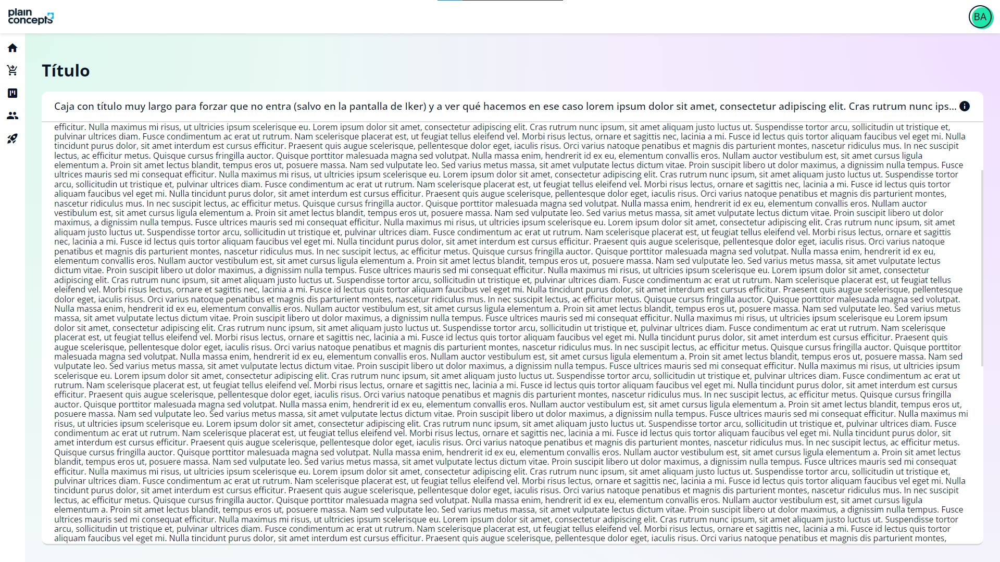
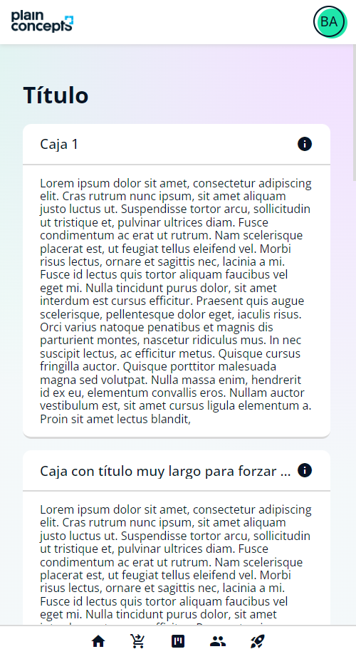
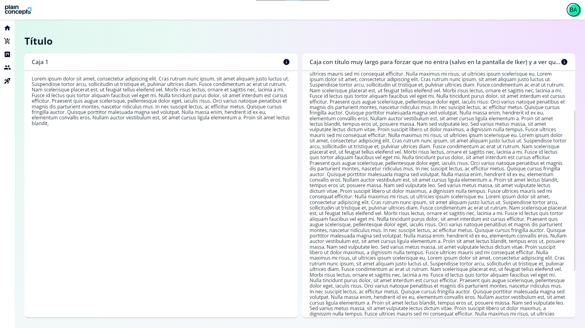

# Kata Layout CSS

Partiendo del HTML, hacer uso de CSS para conseguir el diseño facilitado en las imágenes, teniendo en cuanto la resolución mobile y desktop.

## Paso 1

Los iconos e imágenes ya están añadidos.

Con CSS debería ser suficiente, pero modificar el HTML libremente.

Los ficheros CSS ya están creados, y ciertos selectores y media queries presentados.

### Mobile 

El header y el footer siempre están visibles.

### Desktop

El contenido no permite scroll, sino la caja.

## Paso 2

Añadir otra caja con texto, y que se muestre en 2 columnas en resolución desktop.

### Mobile 

### Desktop

